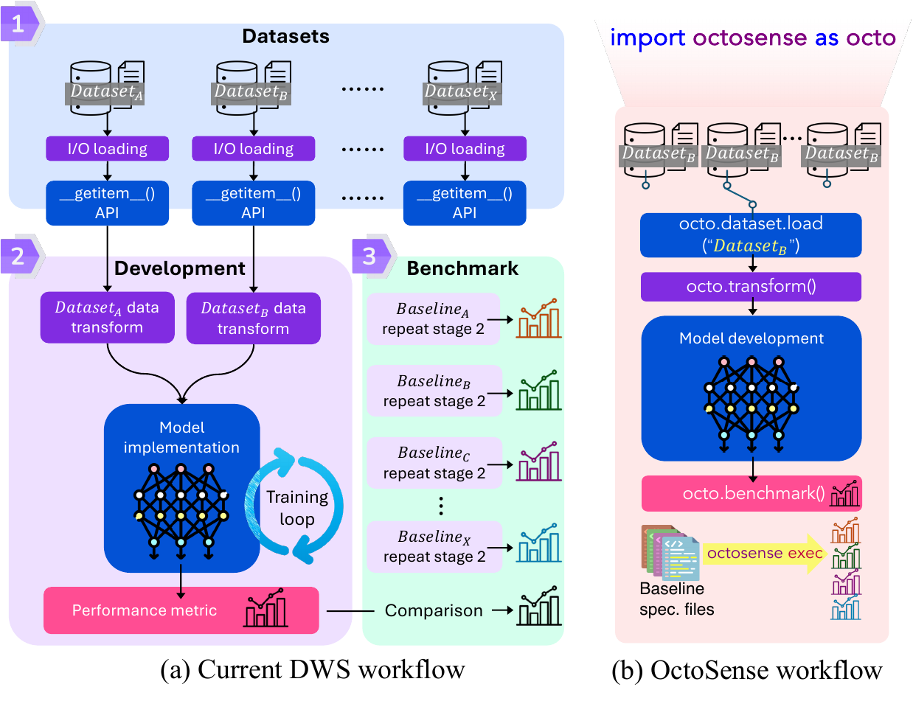

# OctoSense

> A unified research infrastructure for interoperable, reusable, and reproducible wireless sensing.

OctoSense is an academic platform designed to dismantle the reproducibility wall in deep wireless sensing. Instead of treating each new dataset, preprocessing chain, and baseline as an isolated engineering effort, OctoSense organizes the full research workflow through a unified interface that connects dataset access, signal processing, model adaptation, and specification-driven benchmarking.

It is built for a simple goal: wireless sensing research should accumulate, not fragment.

## Contents

- [Why OctoSense](#why-octosense)
- [What We Built](#what-we-built)
- [Supported Hardware](#supported-hardware)
- [Supported Datasets](#supported-datasets)
- [Who OctoSense Is For](#who-octosense-is-for)
- [QuickStart](#quickstart)
- [Outlook](#outlook)



## Why OctoSense

Wireless sensing has become a key modality for physical intelligence, but its research ecosystem is still highly fragmented. In practice, researchers repeatedly rebuild dataset loaders, reverse-engineer undocumented preprocessing steps, and reimplement baselines under incompatible assumptions. As a result, model development, result reproduction, and cross-paper benchmarking remain unnecessarily difficult.

OctoSense addresses this gap by turning the conventional workflow into a semantic-aware and reusable system boundary. The aim is not only to make one experiment easier to run, but to make future work easier to compare, extend, and trust.

## What We Built

OctoSense centers on three tightly connected components:

| Component | What it does | Why it matters |
| --- | --- | --- |
| Unified Data Abstraction | Attaches explicit physical semantics such as sampling rate, frequency, and antenna configuration to heterogeneous RF data at ingestion time. | Makes datasets readable, switchable, and reusable across models and tasks. |
| Standardized Signal Operators | Provides modular, semantic-aware signal processing and model-adaptation operators instead of one-off preprocessing scripts. | Turns hidden preprocessing assumptions into composable and inspectable workflow elements. |
| Rigorous Benchmarking Engine | Serializes datasets, transforms, models, and runtime settings into a specification-driven pipeline. | Makes the specification file the minimal reproducible unit for fair comparison and exact reruns. |

Together, these components make it easier to switch datasets, reuse signal operators, and rerun experiments without rebuilding the surrounding workflow each time.

## How OctoSense Changes the Workflow

OctoSense reorganizes the conventional wireless sensing lifecycle around a single, explicit pipeline:

- Dataset access becomes semantic-aware instead of parser-bound.
- Method development builds on reusable operators instead of local preprocessing scripts.
- Baseline benchmarking is driven by versionable specifications instead of scattered configuration fragments.

This makes experiments easier to understand, reuse, and compare.

## Supported Hardware

OctoSense currently provides the following representative IO entry surfaces.

| Modality | Hardware or source family | Public entry surface | IO package |
| --- | --- | --- | --- |
| WiFi CSI | Intel 5300 CSI Tool captures | `wifi/iwl5300` | `octosense.io.readers.wifi.iwl5300` |
| WiFi CSI | Intel MVM CSI captures | `wifi/iwlmvm` | `octosense.io.readers.wifi.iwlmvm` |
| WiFi CSI | Atheros CSI captures | `wifi/atheros` | `octosense.io.readers.wifi.atheros` |
| WiFi CSI | Broadcom Nexmon captures | `wifi/nexmon` | `octosense.io.readers.wifi.nexmon` |
| WiFi CSI | ESP32 CSI captures | `wifi/esp32` | `octosense.io.readers.wifi.esp32` |
| mmWave | TI DCA1000 raw ADC captures | `mmwave/ti_dca1000` | `octosense.io.readers.mmwave.ti_dca1000` |
| mmWave | HuPR radar-map layout | `mmwave/hupr_radar_map` | `octosense.io.readers.mmwave.hupr_radar_map` |

## Supported Datasets

The following datasets are available through the built-in dataset packages.

| Dataset | Dataset ID | Representative task | Dataset package |
| --- | --- | --- | --- |
| Widar3.0 | `widar3` | Gesture Recognition | `octosense.datasets.builtin.widar3` |
| WiFi Gait | `widargait` | Gait Identification | `octosense.datasets.builtin.widargait` |
| SignFi | `signfi` | Gesture Recognition | `octosense.datasets.builtin.signfi` |
| FallDar | `falldar` | Fall Detection | `octosense.datasets.builtin.falldar` |
| CSI-Bench | `csi_bench` | Activity Recognition | `octosense.datasets.builtin.csi_bench` |
| HuPR | `hupr` | Pose Estimation | `octosense.datasets.builtin.hupr` |
| MM-Fi | `mmfi` | Activity Recognition | `octosense.datasets.builtin.mmfi` |
| XRF55 | `xrf55` | Activity Recognition | `octosense.datasets.builtin.xrf55` |
| XRF V2 | `xrfv2` | Activity Recognition | `octosense.datasets.builtin.xrfv2` |
| OctoNet | `octonet` | Activity Recognition, Pose Estimation | `octosense.datasets.builtin.octonet` |

## Who OctoSense Is For

OctoSense is designed for:

- researchers who want to reproduce or compare baselines without rebuilding every preprocessing detail from scratch;
- model developers who need a stable system boundary around their algorithmic work;
- dataset builders who want newly collected RF data to be reusable beyond a single paper;
- the broader community seeking a sustainable software foundation for wireless sensing research.

## QuickStart

If you are new to the repository, start with `demo/notebook/` and
`src/octosense/`. A minimal first pass is:

1. Create the local environment.

   ```bash
   uv sync
   ```

2. Verify that the package imports from the source tree.

   ```bash
   PYTHONPATH=src uv run python -c "import octosense as octo; print(octo.__version__)"
   ```

3. Start from one entry surface, depending on what you want to inspect:

   - `demo/notebook/` for API-surface notebooks that introduce datasets, transforms, models, pipelines, and specs
   - `src/octosense/` for the canonical implementation modules behind those public surfaces

These steps are enough to inspect the package layout, public APIs, and example workflows.

## Outlook

OctoSense is open infrastructure for the wireless sensing community. The goal is to make future research easier to reuse, compare, and extend around a shared workflow.

If OctoSense is useful for your research, we welcome its use, evaluation, and extension by the community.
